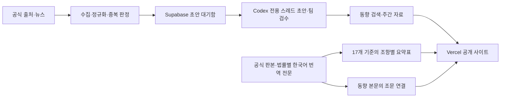

# 국제요정

글로벌 개인정보 보호 동향을 수집·검색하고, 한국어로 해외법제를 읽고 비교하는 플랫폼입니다. 수집 자료에 나오는 법 조항과 법제 DB를 연결하여 소식에서 근거 조문까지 이어서 확인할 수 있도록 기획하고 있습니다.

> **현재 상태: 공개 검토 보드와 팀 전용 검수 경로를 구현하는 단계입니다.** 공개 화면은 RLS가 허용한 발행 자료만 읽고, `/team`은 Supabase Auth 로그인 후 미공개 법제·비교 기준을 읽습니다.

### 로컬에서 검토하기

```bash
pnpm install --frozen-lockfile
pnpm dev
```

브라우저에서 `http://localhost:3000`을 열면 수집 출처·법제 목록·비교 기준 검토 화면을 확인할 수 있습니다. 화면의 `PREVIEW · 샘플 데이터` 표시는 실제 운영 데이터가 아직 연결되지 않았다는 뜻입니다. Vercel 프로젝트를 GitHub에 연결하면 PR 브랜치마다 Preview 배포가 생성됩니다.

팀 검수 화면은 `http://localhost:3000/team`에서 엽니다. Supabase Auth에 등록된 팀 계정으로 로그인해야 하며, 비로그인 사용자는 미공개 법제·기준 데이터를 조회할 수 없습니다. 현재 `/team`은 미공개 항목을 목록·필터로 확인하는 읽기 단계이며, 승인·반려·검수 메모 저장은 아직 연결되지 않았습니다.

## 문서

| 문서 | 용도 |
| --- | --- |
| [architecture.md](./architecture.md) | 제품 범위, 수집·검색 파이프라인, 법제 비교 UX, 데이터 모델, 권한, 배포, 개발 단계 |
| [README.md](./README.md) | 프로젝트 소개, 현재 상태, 팀 참여 및 재현 가능한 개발 환경의 준비 기준 |
| [docs/team-onboarding.md](./docs/team-onboarding.md) | 비개발자 팀원을 위한 역할, Codex 사용법, GitHub·PR 작업 순서 |

문서 기준일은 2026-09-27입니다. 확정 요구사항과 제안·미정 사항은 architecture.md에서 구분합니다.

## 제공하려는 기능

1. **글로벌 동향 수집과 주간 자료**: 감독기구·국제기구·판례·주요 매체의 자료를 수집합니다. 같은 Codex 프로젝트의 전용 스레드가 지정 양식의 한국어 초안을 만들고 Supabase에 반환하며, 팀 검수 후 발행합니다.
2. **동향 검색**: 키워드와 의미 검색을 함께 사용하고 관련도·원문 게시일·국가·주제·출처로 탐색합니다.
3. **해외법제 열람과 비교**: 해외법마다 전체 조문을 읽을 수 있는 한국어 번역 전문을 만들고, 한국법은 공식 한국어 전문을 기준으로 삼습니다. 첫 범위는 한국 개인정보 보호법, 일본 APPI, 중국 PIPL, EU GDPR, 영국 UK GDPR, 미국 캘리포니아 CCPA, 싱가포르 PDPA입니다. 각 전문을 완성한 뒤 17개 기준에 따라 조항을 분류한 요약표에서 근거 조문을 바로 확인합니다.
4. **조문 연결**: 동향 본문에서 언급한 법 조항의 정확한 버전으로 이동하고, 호버·클릭·키보드·모바일 탭으로 조문을 미리 봅니다.

**공개 범위는 확정되었습니다.** 검수·발행한 자료는 누구나 열람할 수 있고, 수집·편집·검수는 팀원만 수행합니다. 첫 법제 범위는 한국 개인정보 보호법, 일본 APPI, 중국 PIPL, EU GDPR, 영국 UK GDPR, 미국 캘리포니아 CCPA, 싱가포르 PDPA입니다. 초기 동향 수집은 EDPB·OECD·CJEU(CURIA)부터 시작합니다.

## 기술 구성 제안

| 영역 | 선택안 |
| --- | --- |
| 개발·협업 | Codex, 공개 GitHub 저장소, Pull Request 리뷰 |
| 웹·API·배포 | Next.js, TypeScript, Vercel |
| 데이터·인증·파일 | Supabase Postgres, Auth, Storage |
| 검색 | Postgres 어휘 검색 + pgvector 의미 검색 |
| 정기 수집 | Supabase Cron → Queues → 짧은 Edge Functions 작업 |
| 가공·번역 | 같은 프로젝트의 Codex 전용 스레드·Automation + 사람 검수 |
| 긴 문서·OCR·브라우저 | 필요가 확인되면 별도 컨테이너 워커 추가 |



초안 생성에는 별도 생성형 AI API를 사용하지 않습니다. 같은 Codex 프로젝트에 전용 작업 스레드를 두고 Automation으로 정기 실행합니다. 수집기는 Supabase에 대기 작업을 쌓고, Codex 스레드가 이를 가져와 구조화된 초안과 근거를 다시 저장합니다. 사이트가 Codex 스레드를 실시간 호출하지는 않습니다.

수집과 공개 사이트는 Codex가 꺼져 있어도 계속 작동합니다. 다만 Codex 앱 또는 자동화 실행 환경이 멈추거나 구독 사용 한도에 도달하면 초안 생성은 대기합니다. 이 방식은 OpenAI API 별도 과금을 피하지만 Codex 구독 사용량과 Supabase·Vercel 사용량은 소비합니다. [Codex의 병렬 스레드와 Automations](https://developers.openai.com/blog/run-long-horizon-tasks-with-codex)

## 설계에서 지키는 원칙

- 공식 API·RSS를 우선 사용하고, 필요한 출처에만 HTML·PDF 수집을 추가합니다.
- AI 요약·번역·비교 결과는 근거와 검수 상태를 갖습니다. 원문에 없는 내용을 사실로 채우지 않습니다.
- 해외법의 한국어 번역은 법률별 전문 문서로 조문 순서를 보존합니다. 원문과 누락을 대조한 뒤 그 조항을 17개 기준표에 연결합니다.
- 원문 게시일, 사건일, 수집일, 사이트 공개일을 구분합니다.
- 법령 개정 전후 버전과 번역 버전을 보존합니다. 오래된 동향의 인용을 현재 조문으로 조용히 바꾸지 않습니다.
- 비교표의 미검토·자료 없음·직접 규정 미발견을 구분합니다.
- 검색·집계·조문 팝업·다운로드에도 동일한 공개 권한을 적용합니다.
- 실패한 수집 작업은 기록하고 재처리합니다. 같은 자료를 반복 수집해도 발행 항목이 중복되지 않게 합니다.
- 공개 소스코드와 외부 원문·운영 데이터의 공개 범위를 분리합니다.

## 팀원이 지금 참여하는 방법

1. architecture.md를 읽고 요구사항과 잠정 가정을 확인합니다.
2. 동향 담당은 EDPB·OECD·CURIA 출처와 샘플을, 법제 담당은 공식 판본과 번역 출처를 정리합니다. [팀 온보딩 가이드](./docs/team-onboarding.md)의 프롬프트를 따릅니다.
3. [globaltrend 저장소](https://github.com/parksunup/globaltrend)의 이슈에서 담당 범위와 완료 조건을 정하고 각자 작업 브랜치를 만듭니다.
4. 첫 개발은 수동 등록/공식 출처 3곳에서 시작해 검수·발행까지 한 번 완주하는 범위로 잡습니다.
5. 동향 수집·검색 개발과 법제 자료 준비는 병행할 수 있습니다. 법제 담당은 공식 판본 확정 → 법률별 한국어 번역 전문 완성 → 17개 기준의 조항별 요약표 순서로 진행하고, 이후 동향의 조문 인용을 연결합니다.

모든 변경은 GitHub Pull Request 단위로 관리합니다. 작업 브랜치에서 PR을 만들면 연결된 Vercel Preview로 화면을 확인할 수 있습니다. GitHub Actions 자동 검증은 아직 저장소에 설정되지 않았으므로 PR마다 실행한 검증 결과를 적고, 자동 검증을 추가할 때는 `.github/workflows/`에 설정을 기록합니다. 동료 리뷰와 필요한 법제·번역 검수를 거쳐 승인된 PR만 `main`에 merge하며, merge 후 Supabase migration·워커·Vercel 운영 배포를 순서대로 진행합니다. `main` 직접 push와 승인 없는 merge는 사용하지 않습니다.

법제 범위는 **한국 개인정보 보호법, 일본 APPI, 중국 PIPL, EU GDPR, 영국 UK GDPR, 미국 캘리포니아 CCPA, 싱가포르 PDPA**로 확정되었습니다. 영국은 UK GDPR과 Data Protection Act 2018 등 보완 법령을 연결해 관리합니다. 비교 기준은 한국·일본 비교표의 17개 행을 기본으로 사용합니다. 현행 조문과 판본은 별도로 검증합니다. 주간 자료는 팀원이 작업 브랜치에 추가한 기준 자료의 표지·목차·항목 본문 구조를 웹 템플릿의 기준으로 삼습니다.

번역 전문의 GitHub 공개 가능 여부는 원문·번역의 이용조건에 따라 판단합니다. 현재 `/team`은 미공개 자료를 읽는 단계이므로, 공개하기 어려운 번역 초안을 팀원끼리 제출·검수할 화면은 법제 기능을 구현할 때 추가해야 합니다.

## 구현 이후의 로컬 개발 환경 기준

이 절은 팀원이 새 컴퓨터에서 작업을 재현할 때 필요한 기준입니다. 현재 앱의 실행과 환경 설정은 위의 로컬 검토 절을 먼저 따르고, 이 절의 나머지 항목은 기능을 확장할 때 확인합니다.

### 준비 도구

- Git, 프로젝트가 고정한 Node.js 버전과 패키지 매니저.
- 로컬 Supabase를 사용하는 경우 지원되는 컨테이너 런타임과 고정된 Supabase CLI 버전.
- Edge Functions 개발·검증에 필요한 Deno 환경. Next.js의 Node 환경과 혼동하지 않도록 안내합니다.
- 로컬 합성 seed와 고정된 Codex 결과 fixture. Codex를 실제로 실행하지 않아도 화면·권한·DB·검색의 핵심 테스트를 실행할 수 있어야 합니다.

구현 시 런타임 버전, 패키지 매니저, 의존성 잠금 파일, Supabase 설정을 저장소에 고정합니다. 운영 DB 접근 없이도 기여할 수 있는 것이 완료 조건입니다.

### 새 개발자에게 제공할 순서

1. 생성된 저장소를 clone합니다.
2. 저장소에 고정한 도구 버전으로 의존성을 설치합니다.
3. `.env.example`을 복사하고 로컬 개발 값만 입력합니다.
4. 로컬 Supabase를 시작하고 migration과 합성 seed를 적용합니다.
5. 웹 및 로컬 Edge Functions를 실행합니다. 실제 외부 수집 스케줄은 비활성 상태로 시작합니다.
6. 예제 동향 검색 → 팀 계정 검수 → 예제 주간호 발행 → 예제 조문 확인 흐름을 실행합니다.
7. 관련 검증을 통과시킨 뒤 작업 브랜치에서 PR을 만듭니다.

현재는 위 절차용 코드·설정·스크립트가 없습니다. 첫 구현 PR은 각 단계의 **실제 실행 명령**, Windows 및 팀의 지원 OS 안내, 예상 결과, 오류 해결법을 이 문서에 추가해야 합니다.

### 환경변수 계약안

이름은 구현 시 확정하며 아래에는 실제 값을 적지 않습니다.

| 예시 이름 | 위치 | 용도 |
| --- | --- | --- |
| `NEXT_PUBLIC_SUPABASE_URL` | 웹 공개 설정 | 해당 환경의 Supabase 주소 |
| `NEXT_PUBLIC_SUPABASE_PUBLISHABLE_KEY` | 웹 공개 설정 | RLS가 적용되는 공개 클라이언트 키 |
| `SUPABASE_SECRET_KEY` | 필요한 서버/워커에만 | 권한 있는 내부 작업. 일반 공개 조회에 사용하지 않음 |
| `CODEX_DRAFT_WORKER_TOKEN` | Codex 로컬 작업 환경 | 초안 claim·submit·fail 전용 RPC 인증. 브라우저·Vercel 클라이언트에 노출 금지 |
| `CODEX_DRAFT_BATCH_SIZE` | Codex 작업 환경 | 자동화 한 번에 처리할 최대 문서 수 |
| `EMBEDDING_MODEL` | 검색 워커/서버 | 한국어·다국어 의미 검색 모델 설정 |
| `WORKER_TRIGGER_SECRET` | Supabase 수집 워커 | 수집·추출 소비자 호출 검증 |
| `DATABASE_URL` | 로컬/승인된 migration 작업 | 스키마 작업에 필요한 연결 |
| `COLLECTION_ENABLED` | 워커 | 로컬·Preview에서 실제 수집 차단 |
| `SITE_URL` | 웹 서버 | 절대 링크·인증 리디렉션 기준 |

호스팅 Edge Functions의 예약 환경변수와 키 주입 방식은 구현 시 공식 문서로 확인합니다. `.env.example`에는 이름·설명만 넣고, `.env*` 실제 파일·운영 덤프·토큰·`.vercel` 연결 정보는 커밋 대상에서 제외합니다. 공개 가능한 설정과 서버 비밀값의 구분은 필수입니다.

## 구현 시 만들 저장소 구조

아래는 **예정 구조**입니다. 현재 존재하는 파일은 README.md와 architecture.md입니다.

```text
/
├── README.md
├── architecture.md
├── apps/
│   └── web/                    # Next.js 공개·팀 화면과 API
├── packages/
│   ├── contracts/              # 데이터·작업 payload 스키마
│   ├── ingestion/              # 출처 어댑터·정규화
│   ├── processing/             # 정규화·규칙 필터·초안 작업 계약
│   ├── search/                 # 검색 계약·평가 도구
│   └── templates/              # 보고서 렌더링
├── supabase/
│   ├── migrations/             # 테이블·RLS·함수·확장 설정
│   ├── functions/              # 짧은 큐 소비자
│   ├── tests/                  # 데이터·권한 검증
│   └── seed.sql                # 합성 데이터
├── tests/
│   ├── fixtures/               # 재배포 가능한 추출 표본
│   ├── search-evaluation/      # 한국어 질의·관련성 평가
│   └── e2e/                   # 핵심 사용자 흐름
├── docs/                       # 개발 계획·운영 절차·결정 기록
├── .agents/skills/             # Codex 초안 생성·검수 작업 지침
├── .github/                    # CI·PR 템플릿·소유자 설정
├── .env.example
├── .gitignore
└── LICENSE                     # 소유자가 라이선스 선택 후 추가
```

순수 TypeScript 데이터 계약은 Node/Deno 양쪽에서 재사용하되 런타임 전용 코드를 분리합니다. Supabase 함수 배포에 필요한 공유 모듈 포함 경로도 자동 검증합니다. 처음에는 실제로 필요한 패키지만 생성합니다.

## 기여와 검증

짧은 작업 브랜치에서 수정하고 PR에 문제·변경 결과·검증 결과를 적습니다. `main` 직접 변경보다 리뷰를 거치는 방식을 기본으로 합니다. 출처 파서 변경에는 재배포 가능한 회귀 표본을, 검색 변경에는 같은 질의셋의 전후 비교를, 권한 변경에는 허용·거부 검증을 포함합니다.

첫 구현 이후 CI가 확인해야 할 항목은 다음과 같습니다.

- lint·타입·웹 빌드와 변경한 기능의 테스트.
- 빈 로컬 DB에 migration을 처음부터 적용할 수 있는지 여부.
- 비로그인·비팀원·팀 역할별 자료 접근과 파일·검색 권한.
- 중복 실행·중단 후 재처리, 주간 경계, 판본을 고정한 조문 연결.
- 검색·주간호·비교표의 핵심 브라우저 흐름과 모바일·키보드 사용.

외부 fork PR에는 DB·Codex 워커·배포 비밀키를 제공하지 않습니다. 코드 검증에 실제 운영 기사·사용자 자료나 실제 Codex 실행이 필요하지 않도록 합성 데이터와 고정 결과를 준비합니다.

## 배포 기준

웹은 Vercel, DB·파일·수집 작업은 Supabase에 배포합니다. 로컬/Preview/운영 데이터를 분리하고, Preview는 운영 DB와 운영 수집기를 사용하지 않습니다.

권장 순서는 **PR 검증 → Preview 확인 → 호환 DB migration → 워커·웹 배포 → 핵심 흐름 확인 → 운영 기능 활성화**입니다. migration과 무관하게 새 웹이 먼저 공개되는 일이 없도록 운영 릴리스 게이트를 둡니다. 구체적인 워크플로 파일과 배포 절차는 첫 배포 PR에서 검증하여 추가합니다. [Vercel GitHub 연동 문서](https://vercel.com/docs/git/vercel-for-github)

이 저장소에는 운영 프로젝트·배포 URL·정기 수집 설정이 아직 지정되지 않았습니다. 이 문서 작성 과정에서는 GitHub 원격 저장소나 Supabase/Vercel 프로젝트를 생성하지 않았습니다.

## 개발 단계

| 단계 | 목표 |
| --- | --- |
| P0 | 7개 법제 목록, EDPB·OECD·CJEU 출처, 주간 PDF 구조, 비교 기준, 예산·검수 담당·라이선스 확정 |
| P1 | 재현 가능한 개발 환경과 소규모 수집→Codex 초안→검수→발행 전체 흐름 |
| P2 | 일일 동향 수집, 하이브리드 검색, 주간 자료 운영 |
| P3 | 지정 법제의 판본·법률별 한국어 번역 전문·17개 기준표·동향 조문 연결 |
| P4 | 실제 양식의 파일 출력, 필요한 고급 수집과 추가 법제 |

세부 완료 조건은 [architecture.md](./architecture.md)에 있습니다. 날짜·공수·월 운영비는 실제 자료량과 팀 구성 확인 후 산정합니다.

## 공개 코드와 콘텐츠 이용

코드 라이선스는 **미선정**이며 MIT를 후보로 제안합니다. 소유자 선택 후 LICENSE를 추가합니다. 외부 기사·판례·법령·번역·보고서 데이터는 코드 라이선스에 자동 포함하지 않습니다. 공개 저장소를 만드는 것만으로 소프트웨어 재사용 라이선스가 정해지는 것은 아닙니다. [GitHub 라이선스 안내](https://docs.github.com/en/repositories/managing-your-repositorys-settings-and-features/customizing-your-repository/licensing-a-repository)

외부 자료는 원출처·이용조건·보관·Codex 처리·재배포 범위를 기록합니다. 저장소에는 비밀값, 운영 DB 덤프, 무허가 기사 전문이나 번역 파일을 넣지 않습니다.

