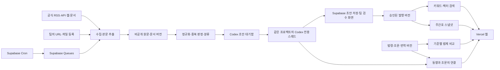
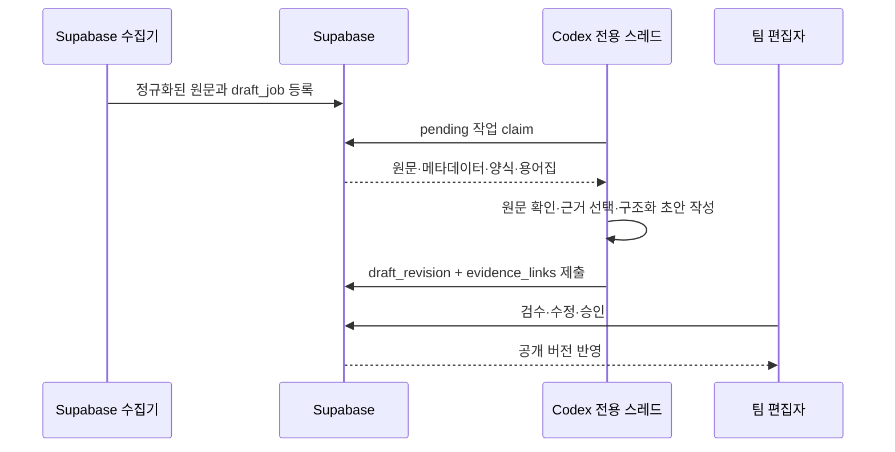
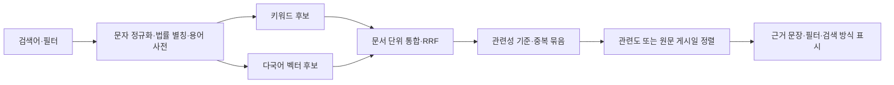
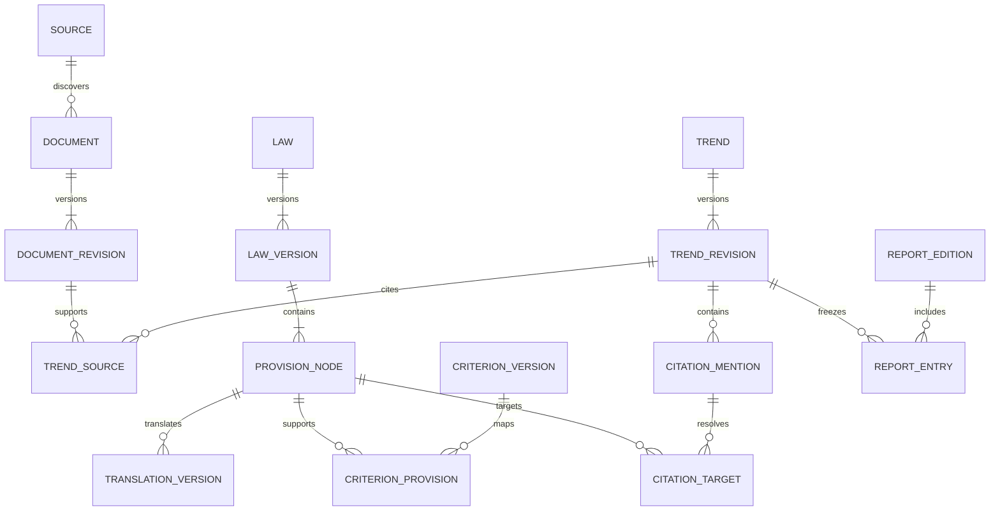

# 국제요정: 글로벌 개인정보 보호 동향·법제 플랫폼 설계안

문서 버전: 0.2 · 작성일: 2026-09-27 · 상태: 검토용 기획 초안

이 문서는 제품 범위, 데이터 파이프라인, 화면 구조, 기술 경계와 개발 순서를 제안합니다. 현재 애플리케이션·DB·수집기·배포 환경은 구축되지 않았습니다. 아래의 처리 주기, 국가, 품질 목표와 데이터 구조는 구현의 출발점이며 운영 실적이 아닙니다.

## 1. 만들려는 서비스와 전제

글로벌 개인정보 보호 소식을 한국어로 찾고, 주간 자료로 정리하고, 그 소식에서 언급한 법 조항을 각국 법제와 비교해서 읽을 수 있는 조사·편집 플랫폼입니다. 주요 사용자는 개인정보 보호 정책 담당자, 연구자와 실무자로 가정합니다.

### 1.1 사용자께서 지정하신 사항

- Codex에서 개발하고, Supabase를 데이터 기반으로 사용하며, Vercel로 배포합니다.
- GitHub에 소스코드를 공개하여 팀이 함께 개발할 수 있도록 합니다.
- 뉴스·감독기구·국제기구·판례 자료를 주기적으로 수집하되, 첫 운영은 EDPB·OECD·CJEU(CURIA)로 시작하고 이후 출처를 확장합니다.
- 지정 양식의 주간 동향 자료를 생성합니다.
- 키워드·의미 검색, 관련도·최신순 정렬, 국가 등의 필터를 제공합니다.
- 해외법의 한국어 번역, 단독 열람, 한국법 및 제3국 법과의 비교를 제공합니다.
- 사용자가 정한 비교 기준을 행으로, 선택한 국가·법률을 열로 하는 요약표를 제공합니다.
- 동향 본문의 법 조항과 법제 DB를 연결하고 조문 미리보기를 제공합니다.
- 검수 완료 자료는 누구나 열람하고, 수집·편집·검수는 팀원만 수행합니다.
- 첫 비교 법제 범위는 다음 7개로 지정되었습니다: 한국 개인정보 보호법, 일본 APPI, 중국 PIPL, EU GDPR, 영국 UK GDPR, 미국 캘리포니아 CCPA, 싱가포르 PDPA.
- 초기 동향 수집 출처는 EDPB, OECD, CJEU(CURIA)부터 시작합니다. 다른 출처는 이 세 곳의 수집·검수 흐름이 안정된 뒤 확장합니다.
- 비교 기준과 주간 자료 양식은 팀원이 작업 브랜치에 추가한 한국·일본 비교표와 주간동향 기준 자료를 기준으로 삼습니다. 원본 파일이 없는 상태에서는 기준이나 양식을 추정하지 않습니다.

### 1.2 확정 사항과 아직 결정하지 않은 운영 가정

| 항목 | 잠정안 | 달라질 경우 영향 |
| --- | --- | --- |
| 서비스명 | 국제요정 | 표시명·도메인만 변경 |
| 공개 범위 — 확정 | 검수·발행한 자료는 공개, 초안·수집 원문·편집 화면은 팀 전용 | 공개·팀 권한을 분리하여 구현 |
| 첫 법제 범위 — 확정 | 한국 개인정보 보호법, 일본 APPI, 중국 PIPL, EU GDPR, 영국 UK GDPR, 미국 캘리포니아 CCPA, 싱가포르 PDPA | 판본·시행일·공식 원문을 확정한 뒤 번역·검수량 산정 |
| 수집 출발점 — 확정 | EDPB, OECD, CJEU(CURIA) 3개 공식 출처, 최근 90일 이내부터 제한적 역수집 | 수집량·초기 비용 변경 |
| 수집 주기 | 출처별 하루 1회, 중요 출처는 운영 검증 후 단축 | 처리량·비용 변경 |
| 주간 자료 | 월요일 09:00 한국시간에 전주 자료 초안 생성, 검수 후 수동 발행 | 스케줄·템플릿 변경 |
| 결과물 | 웹 보고서 우선, PDF·DOCX는 실제 양식을 받은 뒤 구현 | 내보내기 작업 범위 변경 |
| Codex 편집 워커 — 확정 | 같은 Codex 프로젝트의 전용 스레드가 분류·요약·번역·조문 후보 초안을 만들고 Supabase에 반환, 공개 전 사람이 승인 | Codex 사용 한도·자동화 실행 환경에 따라 처리 속도 변경 |
| 규모 가정 | 팀 3~10명, 후보 문서 하루 100~300건, 공개 문서 누적 5만 건 이내의 초기 설계 | 실측 후 인덱스·워커 확장 |

공개 저장소가 공개 데이터베이스를 의미하지는 않습니다. 외부 원문, 번역, 팀 초안의 이용·공개 범위는 각각 관리합니다. 초안 생성에는 별도 생성형 AI API를 사용하지 않고 사용자의 Codex 구독과 자동화를 사용합니다. Supabase·Vercel·선택적 검색 인프라의 요금제와 월 예산은 아직 선정하지 않았습니다.

### 1.3 주요 사용자 여정

1. **동향 조사:** `아동` 검색 → 국가·기간 선택 → 관련 동향 확인 → 근거 원문과 관련 조문 확인.
2. **주간 발간:** 자동 수집 → 중복·관련성 검토 → 한국어 초안 수정 → 주간호에 배치 → 검수·발행.
3. **법제 연구:** 국가 선택 → 한국어 조문 열람 → 비교 국가 추가 → 같은 기준의 관련 조문을 나란히 확인.
4. **비교표 관리:** 기준 추가·순서 변경 → 법령별 관련 조문 후보 확인 → 요약·근거 검수 → 비교표 공개.

## 2. 권장 접근과 대안

| 접근 | 장점 | 부담·한계 | 판단 |
| --- | --- | --- | --- |
| A. Vercel 웹 + Supabase DB·작업 큐 + 짧은 Edge 작업 | 사용자가 선택한 서비스 중심, 운영 구성 단순, 검색·권한 일원화 | 긴 PDF·OCR·브라우저 작업은 별도 실행 환경 필요 | **초기 권장** |
| B. Vercel 웹 + Supabase + 전용 컨테이너 수집 워커 | 대량 수집·브라우저·OCR 처리에 유연 | 추가 서비스·배포·비용·모니터링 필요 | 규모와 수집 실패율을 보고 도입 |
| C. 팀이 URL·파일을 등록하고 자동 가공만 수행 | 양식과 검수 흐름을 빠르게 검증 | 자동 수집 요구를 충분히 충족하지 못함 | 첫 시범 운영 및 수집 실패 시 보완 경로 |

A를 기본으로 만들되 URL·파일 수동 등록 경로를 함께 둡니다. 초기에는 RSS/API 및 가벼운 HTML 수집을 운영하고, 대형 PDF·스캔·브라우저 자동화는 별도 워커 단계로 확장합니다. 지원하지 않는 문서는 조용히 누락하지 않고 관리자 대기함에 표시합니다.

## 3. 전체 아키텍처

### 3.1 구성요소의 책임

| 구성요소 | 역할 | 운영 원칙 |
| --- | --- | --- |
| Next.js + TypeScript / Vercel | 공개 화면, 팀 편집 화면, 검색·발행 API | 읽기와 짧은 요청 처리에 집중 |
| Supabase Postgres | 자료, 버전, 비교 기준, 편집 상태, 관계 | SQL migration으로 변경 이력 관리 |
| Supabase Auth | 팀원 초대·로그인 | 가입 여부와 편집 권한을 별도 확인 |
| Supabase Storage | 허용된 원문 파일, 추출 결과, 내보내기 파일 | 기본 비공개, 공개 산출물만 별도 공개 |
| Postgres 검색 + pgvector | 어휘 검색, 다국어 의미 검색 | 한국어 품질 평가 후 검색기 확장 |
| Supabase Cron + Queues | 실행 시점 계산, 작업 보관, 재처리 | 스케줄러는 하나만 활성화 |
| Supabase Edge Functions / Deno | 가벼운 수집·추출·정규화·큐 작업 | 생성형 초안은 수행하지 않으며 실행 제한 안에서 완료 |
| Codex 전용 스레드 + Automation | 대기 자료 확인, 한국어 요약·번역·태그·조문 후보 생성, 결과 반환 | 동일 프로젝트의 지침·양식·용어집을 사용하고 Codex 사용량을 소비 |
| 저장소의 Codex 작업 스킬·스크립트 | 작업 claim, 입력 묶음 생성, JSON 검증, 초안 제출 | 사람과 Codex가 같은 재현 가능한 계약을 사용 |
| GitHub + Actions | 코드·리뷰·검증·배포 절차 | 실제 수집 스케줄러로 사용하지 않음 |
| 향후 컨테이너 워커 / Node.js | 긴 PDF, OCR, 헤드리스 브라우저, 무거운 내보내기 | 필요가 확인되면 호스팅 서비스 별도 선정 |

Supabase는 Cron, 영속 큐, Edge 소비자를 제공하므로 위 조합을 사용할 수 있습니다. 구체적인 병렬도와 타임아웃은 구현 때 선택한 요금제와 실제 문서 크기로 결정합니다. [Cron](https://supabase.com/docs/guides/cron), [Queues](https://supabase.com/docs/guides/queues), [Edge 소비자](https://supabase.com/docs/guides/queues/consuming-messages-with-edge-functions), [실행 제한](https://supabase.com/docs/guides/functions/limits)

Vercel Cron을 대안 스케줄러로 선택할 수는 있지만, 기본안에서는 사용하지 않습니다. Vercel의 스케줄 호출 자체가 실패 작업의 재시도를 제공하지 않으므로 어느 스케줄러를 쓰더라도 큐·중복 방지·복구는 애플리케이션에 필요합니다. [Vercel Cron 운영 문서](https://vercel.com/docs/cron-jobs/manage-cron-jobs)

### 3.2 Codex 전용 스레드를 편집 워커로 사용

초안 생성은 별도 OpenAI API를 호출하지 않습니다. 이 프로젝트 안에 `동향 초안 생성` 전용 Codex 스레드를 만들고, Codex Automation이 정해진 주기에 이 스레드를 실행하도록 구성합니다. Codex 앱은 같은 프로젝트에서 병렬 스레드와 백그라운드 Automation을 지원합니다. 이 방식은 별도 OpenAI API 과금을 피하지만 Codex 구독의 사용 한도는 소비합니다. 구독별 정확한 자동화 가용성과 한도는 설정 시 계정에서 확인합니다. [Codex 장기 작업과 Automations](https://developers.openai.com/blog/run-long-horizon-tasks-with-codex)

사이트가 Codex 스레드에 직접 요청을 보내는 구조는 사용하지 않습니다. 수집기는 Supabase에 작업을 쌓고, Codex Automation이 이를 **당겨 가는 방식**으로 동작합니다. 이 경계 덕분에 공개 웹 요청과 Codex 앱 로그인·구독을 결합하지 않아도 됩니다.

전용 스레드에는 다음 계약을 둡니다.

- 한 실행에서 처리할 최대 작업 수와 최대 원문 길이를 정합니다. 새 작업이 없으면 아무것도 쓰지 않고 종료합니다.
- 작업을 가져올 때 lease와 `claimed_by`, `claimed_until`을 기록합니다. 중단되면 lease 만료 후 다음 실행이 이어받습니다.
- 원문, 문서 메타데이터, 작성 양식, 용어집 버전만 입력으로 사용합니다. 웹에서 새 사실을 보충했다면 별도 출처로 저장하기 전에는 초안 사실 근거로 쓰지 않습니다.
- 출력은 저장소에 정의한 JSON Schema로 검증합니다. 필수 필드는 한국어 제목·요약·핵심 내용·근거 문단·관련 국가·주제·법조문 후보·확신도·주의사항입니다.
- 제출 전 각 주장에 원문 근거가 있는지 검사합니다. 불확실하거나 원문이 부족한 작업은 `needs_human_review`로 반환합니다.
- 초안 생성 지침·양식·용어집·출력 스키마는 Git에 버전 관리합니다. DB에는 Codex 모델/설정, 스레드/실행 식별자, 지침 commit SHA와 결과 시각을 남깁니다.
- Codex가 직접 공개 상태로 바꾸지 못하게 합니다. 초안 작성 권한과 발행 승인 권한을 분리합니다.

Codex가 Supabase에 접근하는 첫 구현은 저장소의 제한된 명령(`draft:claim`, `draft:submit`, `draft:fail`)을 호출하도록 합니다. 명령은 전용 워커 자격으로 좁은 RPC만 사용합니다. Supabase 플러그인은 개발·점검과 수동 복구에 사용하되, 반복 자동화가 광범위한 관리 권한에 의존하지 않게 합니다. 워커 자격증명은 로컬 Codex 실행 환경에만 저장하며 Git·브라우저·Vercel 클라이언트에 넣지 않습니다.

수집과 사이트 검색·열람은 Codex 실행 여부와 독립적으로 계속 작동합니다. Codex 앱이나 해당 컴퓨터가 꺼져 있거나 사용 한도에 도달하면 원문 수집은 계속되고 초안 작업만 `pending`으로 쌓입니다. 대기량·가장 오래된 작업·마지막 성공 실행을 관리자 화면에 표시하고, 스레드를 수동 실행해 따라잡을 수 있게 합니다.

## 4. 동향 수집과 주간 자료 파이프라인

### 4.1 크롤링 전략

우선순위는 **공식 API → RSS/Atom → 정적 HTML → PDF 본문 추출 → 필요한 사이트만 브라우저 자동화**입니다. 사이트별 최적 경로는 다를 수 있으며 API가 있다고 가정하지 않습니다.

- 출처 등록 시 목록 URL, 허용 호스트, 수집 방법, 언어, 발행 주기, 담당자, 이용조건, 원문 저장·Codex 처리·재배포 허용 범위를 기록합니다.
- RSS는 새 문서 발견용입니다. 본문 전문이 없으면 별도로 원문을 수집하고, 제목만으로 본문 요약을 만들지 않습니다.
- HTML은 출처별 어댑터가 제목·날짜·본문·문서 링크를 추출합니다. 범용 추출기는 보조로 사용합니다.
- PDF는 페이지·문단 위치를 보존합니다. 스캔 문서는 OCR 필요 상태로 분류하고 낮은 추출 신뢰도를 검수자에게 보여줍니다.
- ETag·Last-Modified, 요청 간격, 요청 수 상한을 사용합니다. robots.txt와 이용조건을 확인하며, robots.txt 허용을 재사용 허가로 간주하지 않습니다.
- 유료벽·로그인·접근 제한을 우회하지 않습니다. 전문 수집 권한이 없는 뉴스는 허용된 메타데이터와 링크 중심으로 등록합니다.
- G7 등 연도별 주최 기관이 바뀌는 출처는 `연도 + 행사 + 주최 기관 + 공식 URL`로 관리합니다.

### 4.2 초기 출처 후보와 확인 범위

#### 4.2.1 첫 운영에서 고정할 출처

첫 수집기는 아래 세 곳만 대상으로 시작합니다. 각 어댑터는 공식 목록·RSS·문서 링크를 발견하고, 허용된 원문과 메타데이터를 저장합니다.

| 출처 | 첫 수집 범위 | 문서 유형 구분 |
| --- | --- | --- |
| [EDPB](https://www.edpb.europa.eu/news_en) | 뉴스, 의사결정·의견, 가이드라인, 보도자료 | 감독기구 결정·정책·집행 |
| [OECD 개인정보 보호](https://www.oecd.org/en/topics/privacy-and-data-protection.html) | 주제 페이지, 보고서, 권고·발간물 | 국제기구 정책·연구 |
| [CJEU/CURIA](https://curia.europa.eu/site/) | 판결, 법무관 의견, 보도자료 | 판례·절차·사건 메타데이터 |

CURIA 사건은 사건번호·ECLI·선고일을 저장하고 판결문, 법무관 의견, 보도자료를 별도 문서로 연결합니다. 이 단계에서는 뉴스 매체·GPA·APPA·APEC·G7·국가 감독기구를 자동 수집 범위에 넣지 않고, 위 세 출처의 실패·중복·검수 흐름을 확인한 뒤 확장합니다.

아래는 출처 탐색 결과와 등록 후보입니다. 페이지가 확인되었다고 자동 수집·전문 저장·번역 재배포가 검증된 것은 아닙니다. 개별 커넥터의 접근 정책과 표본 검증은 개발 단계에서 수행합니다.

| 분류 | 후보·근거 링크 | 수집안 및 확인 상태 |
| --- | --- | --- |
| EU 감독기구 | [EDPB 뉴스](https://www.edpb.europa.eu/news_en) | 페이지의 RSS 링크 존재 확인. 피드 본문 조회는 이번 조사에서 실패하여 실제 처리 검증 필요 |
| 국가 감독기구 | [ICO 뉴스](https://ico.org.uk/about-the-ico/media-centre/news-and-blogs/), [CNIL](https://www.cnil.fr/en) | 뉴스·가이드라인·처분을 별도 문서 유형으로 등록. 목록별 추출 시험 필요 |
| 아시아 감독기구 | [일본 PPC](https://www.ppc.go.jp/en/), [싱가포르 PDPC](https://www.pdpc.gov.sg/news-and-events) | PPC 페이지 확인. PDPC는 본문을 충분히 읽지 못해 접근 방식 추가 확인 필요. 원어 사이트도 별도 등록 후보 |
| 국제기구 | [OECD 개인정보 보호](https://www.oecd.org/en/topics/privacy-and-data-protection.html) | 주제 페이지·발간물 링크 확인. 관련 문서만 추출 |
| 감독기구 협의체 | [GPA 채택 결의](https://globalprivacyassembly.com/document-archive/adopted-resolutions/) | 결의 목록·첨부문서 확인. 기존 .org 주소가 .com으로 이동하는 사례를 확인했으므로 공식성·리디렉션을 등록 시 재확인 |
| 아시아태평양 협력 | [APPA](https://appaforum.org/), [APEC DESG](https://www.apec.org/what-we-do/committee-on-trade-and-investment/digital-economy-steering-group/overview--digital-economy-streering-group) | 공개 페이지 확인. APPA 포럼 성과·공동성명, APEC 관련 발간물 목록별 시험 필요 |
| G7 | [2026년 CNIL 안내](https://www.cnil.fr/en/g7-2026-cnil-hosts-roundtable-in-paris) | 해당 연도 감독기구 회의 출처 확인. 정상회의·디지털 장관회의 문서는 별도 출처로 확장 |
| EU 판례 | [CURIA](https://curia.europa.eu/site/), [EUR-Lex 재사용 안내](https://eur-lex.europa.eu/content/help/data-reuse/reuse-contents-eurlex-details.html) | 사건번호·ECLI·CELEX가 있으면 저장. 판결, 법무관 의견, 보도자료를 구분. API·피드 제공 범위와 인증은 개별 확인 |
| 한국법 기준 | [국가법령정보 공동활용](https://open.law.go.kr/LSO/index.html) | 공식 연계 후보. 신청·이용조건 및 법령 연혁/조문 조회 범위 확인 필요 |
| 전문 매체·언론 | [IAPP 뉴스](https://iapp.org/news), [Reuters 기술](https://www.reuters.com/technology/) | IAPP 목록 확인. Reuters는 이번 조회 실패. 이용조건 검토 후 메타데이터·링크 우선, 허가된 전문만 가공 |

첫 운영은 위 세 공식 출처로 검증한 뒤 10~15곳으로 늘립니다. 위 후보 전체를 첫날부터 완전 수집한다고 약속하지 않습니다. 국가 감독기구·법률·협의체는 별개 엔터티이며, EU는 국가 코드와 구분되는 관할권으로 취급합니다.

### 4.3 문서 한 건의 처리 단계

| 단계 | 입력 → 산출물 | 실패·검수 처리 |
| --- | --- | --- |
| 1. 발견 | 피드·목록 → 후보 URL·외부 ID | 페이지 순회 상한, 마지막 성공 지점과 겹치는 구간 재확인 |
| 2. 수집 | 후보 → HTTP 응답·허용된 원본 파일 | 429는 Retry-After 준수, 차단·소실은 상태 표시 |
| 3. 추출 | 원본 → 문단·페이지·표·언어·날짜 | 빈 본문·메뉴만 추출·OCR 필요를 검수함으로 이동 |
| 4. 정규화 | 추출물 → 문서 리비전·해시·정규 URL | 발행일 불명은 불명으로 저장, 수집일로 대체하지 않음 |
| 5. 중복 판정 | 문서 → 완전중복 또는 동일 사건 후보 | 같은 사건의 후속 판결·정정은 별도 유지 |
| 6. Codex 작업 등록 | 문서 리비전·양식판 → `draft_job` | 같은 입력·지침판의 중복 작업 방지 |
| 7. 관련성·한국어 가공 | Codex가 허용된 본문 확인 → 제목·요약·핵심 내용·국가·주제·근거 위치 | 수치·기관·결정/제안 구분을 검사하고 원문과 병렬 검수 |
| 8. 조문 후보 | Codex가 인용 표현 검토 → 법령·버전·조문 후보 | 여러 법이나 시점이 가능하면 미확정 유지 |
| 9. 검수·발행 | 편집 초안 → 승인된 불변 발행 버전 | 수정 시 새 버전 생성, 기존 공개 버전은 승인 전까지 유지 |
| 10. 색인·편성 | 공개 버전 → 검색 색인·주간호 후보 | 색인 지연 상태 노출, 재색인 가능 |

`source_published_at`(원문 게시), `source_updated_at`(원문 수정), `event_date`(판결·발표 등 사건), `first_seen_at`(최초 수집), `released_at`(우리 사이트 공개)을 구분합니다. 날짜만 있는 자료는 날짜 정밀도를 함께 저장하고 시간·시간대를 지어내지 않습니다.

중복은 정규 URL·공식 문서 식별자·본문 해시로 먼저 판단하고 제목·본문 유사도로 사건 묶음 후보를 만듭니다. 한 사건의 감독기구 보도자료와 언론 보도는 함께 묶되 각각의 출처와 내용 차이는 남깁니다.

### 4.4 큐·재시도·멱등성

- Cron은 만기가 된 출처를 찾아 큐에 넣고, 별도 짧은 디스패처가 처리할 작업이 있을 때만 소비자를 호출합니다.
- 최초 설정 예시는 만기 점검 5분, 소비자 호출 점검 1분입니다. 실제 외부 수집은 출처별 주기대로 수행합니다. 운영 환경에서만 활성화합니다.
- 큐 메시지는 전체 본문 대신 `job_id`를 담습니다. 작업의 종류, 대상 버전, 시도 횟수, 다음 시각, 오류를 DB에 기록합니다.
- 발견 작업은 `(source_id, scheduled_window)`, 문서 가공은 `(document_revision_id, stage, processor_version)`를 중복 방지 키로 사용합니다.
- 재배달이 일어날 수 있다는 전제로 설계합니다. DB 결과 저장·다음 작업 등록·현재 메시지 완료는 가능하면 같은 DB 트랜잭션에서 처리합니다.
- 소비 중에는 가시성 제한/lease를 사용합니다. 실제 처리 제한보다 충분히 긴 lease와 만료 복구를 설정합니다. 재시작은 완료된 단계부터 이어갑니다.
- Codex 실행과 DB 트랜잭션은 원자적이지 않습니다. 제출 명령은 `(job_id, input_revision_id, instruction_version)`을 중복 방지 키로 사용하고, 이미 제출된 결과가 있으면 새 초안을 만들지 않습니다. Codex가 결과를 만든 뒤 제출 전에 중단되면 다음 실행에서 같은 작업을 다시 검토할 수 있으므로 최종 저장 단계가 중복을 제거합니다.
- 일시 실패는 예를 들어 1분·5분·30분 간격으로 재시도하되 Retry-After가 더 길면 우선합니다. 영구 실패는 실패 대기열로 옮기고 팀이 재처리합니다.
- HTTP 200이어도 비어 있는 본문·사이트 메뉴·갑작스러운 수집량 급감은 파서 이상으로 분류합니다.
- 응답을 반환한 뒤 메모리에만 남긴 작업에 의존하지 않습니다. 작업 중단 시에도 DB에서 재개할 수 있어야 합니다.

### 4.5 주간 자료 생성

기본 기간은 **전주 월요일 00:00 이상 ~ 이번 주 월요일 00:00 미만, Asia/Seoul**입니다. 09:00에 초안을 만들며 UTC 변환값과 원래 업무 시간대를 모두 기록합니다. 스케줄이 지연돼도 `기간 + 템플릿 버전 + 판본` 키로 한 번만 편성합니다.

1. 전주 원문 게시일에 해당하는 공개 승인 자료를 모읍니다. 아직 미검수인 자료는 편집자 후보함에만 표시합니다.
2. 동일 사건 묶음을 검토하고 공식 1차 출처를 대표 근거로 선택합니다. 시각이 불명확한 자료·지연 발견 자료는 별도 후보 목록에 둡니다.
3. 사용자가 정한 국가·지역/주제 순서와 중요도에 따라 편성합니다. 중요도는 편집자가 변경할 수 있습니다.
4. Codex가 만든 고정 JSON 구조를 승인된 템플릿으로 렌더링합니다. Codex가 매번 표나 문서 구조를 임의로 바꾸지 않습니다.
5. 편집자가 포함·제외·순서·문구를 수정하고 검수자가 발행합니다. 미완료 출처와 수집 기간의 공백도 확인합니다.
6. 발행 시 항목의 정확한 버전, 조문·번역 버전, 템플릿 버전, 생성 시각을 고정합니다.

기본 항목은 `지역/국가 → 제목 → 원문 게시일·사건일 → 핵심 요약 → 주요 내용 → 시사점(편집 의견) → 관련 조문 → 출처`입니다. 사실 요약과 시사점을 구분하고, 주요 주장마다 문서 리비전과 문단·페이지 근거를 연결합니다.

첨부된 2026년 제36호 PDF를 기준으로 초기 주간호는 다음 형식을 고정합니다.

1. 표지: 보고서명, 연도·호수·주차, 발행일.
2. 목차: `해외`와 `국내`처럼 지역/범주를 나누고 항목 번호·분류·제목·출처·페이지를 표시합니다. 초기 자동 수집 범위가 해외 3곳이므로 국내 섹션은 자료가 승인된 경우에만 채웁니다.
3. 항목 본문: 분류 배지(정책/제도·데이터활용/AI/신기술·조사/유출 등), 한국어 제목, 한 문장 핵심 요약, 핵심 내용 bullet, 원문 제목, 출처명·원문 링크를 표시합니다.
4. 부록/참고: 수집 기간, 포함·제외 기준, 정정 이력과 출처 목록을 남깁니다.

웹에서는 목차 항목을 클릭하면 본문으로 이동하고, 원문 제목·출처를 통해 근거 페이지를 열 수 있게 합니다. PDF·DOCX 출력은 이 웹 구조와 필수 필드를 먼저 고정한 뒤 후속 단계에서 추가합니다.

보고서 템플릿은 섹션, 필수 필드, 길이 제한, 날짜 형식, 출처 표기법, 정렬 규칙, 표·각주 스타일을 버전으로 저장합니다. 일반 편집자가 실행 가능한 HTML·스크립트를 템플릿에 넣지 못하도록 합니다. 초기에는 팀 공용 템플릿 하나를 지원하고 사용자의 실제 양식으로 확정합니다.

뒤늦게 발견한 이전 주 자료는 다음 호의 보충 후보 또는 해당 호의 정정판으로 처리합니다. 기존 주간호를 조용히 덮어쓰지 않습니다. 완전성 표시도 `등록한 출처 중 정상 확인한 범위`를 뜻하며 전 세계 동향을 빠짐없이 수집했다는 뜻은 아닙니다.

## 5. 키워드·의미 검색

### 5.1 검색 대상과 방식

첫 검색 탭은 동향이며 주간호와 법제는 별도 탭으로 구분합니다. 공개 검색은 공개가 허용된 제목·요약·본문·태그·근거 메타데이터만 색인합니다. 팀 초안 검색은 권한이 다른 별도 범위입니다.

- **키워드:** 제목·법률명·조문번호·주제 태그·한국어 본문을 검색합니다. Postgres full-text와 정확 일치, 부분 일치 보조를 조합합니다.
- **한국어:** 영어 FTS 설정으로 한국어 검색이 해결된다고 가정하지 않습니다. 정규화된 한국어 용어·편집 태그를 별도 저장하고 `simple` 기반 어휘 색인과 `pg_trgm` 보조를 평가합니다. 조사·복합명사·두 글자 검색의 누락을 별도로 측정합니다.
- **의미 검색:** 초안 생성과 분리된 기능입니다. 한국어 질의와 다국어 자료를 다룰 수 있는 임베딩을 선정하고 조문/문단 경계로 나눕니다. 별도 생성형 AI API는 사용하지 않는다는 원칙 아래, 초기에는 로컬/자체 호스팅 다국어 임베딩 모델을 후보로 검증합니다. 문서와 사용자 질의에 같은 모델·전처리를 적용하고 모델·차원·분할 버전을 저장합니다.
- **용어 확장:** `아동` → `어린이`, `미성년자`, `children`, `minors` 등의 검수된 후보를 사용합니다. 법률별 아동 연령이나 적용 범위가 같다는 뜻으로 취급하지 않습니다.
- **통합:** 키워드와 벡터 후보를 각각 순위화한 뒤 문서별로 합쳐 `RRF = Σ weight / (k + rank)`로 정렬합니다. 초기 실험값은 각 100개 후보, 동일 가중치, k=60입니다. 성능 보장이 아닌 조정 시작점입니다.
- 긴 문서가 청크 수 때문에 유리해지지 않도록 문서별 상위 청크만 반영합니다. 단순한 원점수 합산은 하지 않습니다.
- 의미상 거리가 먼 자료까지 항상 top-k로 보여주지 않도록 평가셋으로 임계값을 정합니다. 벡터 유사도를 정확도 퍼센트로 표시하지 않습니다.
- 임베딩 검색 장애 때는 키워드 검색을 유지하고 `키워드 검색으로 표시 중`이라고 안내합니다. 재순위 모델은 초기 필수 구성이 아닙니다.

키워드·의미 결과의 결합은 Supabase의 하이브리드 검색 설계를 참고하되, 한국어 처리와 공개 권한·문서별 통합은 이 서비스에서 별도로 설계합니다. Supabase Edge의 내장 `gte-small`은 공식 문서상 영어 전용이므로 한국어 의미 검색의 기본 모델로 채택하지 않습니다. 자체 호스팅 다국어 모델의 품질·지연·운영 비용을 평가한 뒤 확정합니다. [하이브리드 검색](https://supabase.com/docs/guides/ai/hybrid-search), [Supabase Edge AI 모델](https://supabase.com/docs/guides/functions/ai-models), [Postgres 검색 사전](https://www.postgresql.org/docs/current/textsearch-dictionaries.html)

### 5.2 필터와 정렬 규칙

| 항목 | 동작 |
| --- | --- |
| 국가/관할권 | 관련 국가 기준, 발행 기관 소재지와 분리. 여러 국가 선택은 OR |
| 지역·발행 기관·주제·자료 유형 | 서로 다른 필터 종류는 AND, 같은 필터 내 다중 선택은 OR |
| 기간 | 기본은 원문 게시일, 사건일·사이트 공개일은 별도 옵션 |
| 관련도순 | 통합 순위, 동점은 원문 게시일·고정 ID |
| 최신 게시순 | 검색어에 관련된 후보 내 원문 게시일 내림차순. 날짜 불명은 뒤로 배치 |
| 국가별 보기 | 국가 그룹으로 묶고 각 그룹 안에서 관련도 또는 최신순 |
| 정확한 표현 | 따옴표 입력 또는 키워드 모드, 의미 확장을 끌 수 있음 |

권한·국가·날짜 조건은 두 검색 경로의 후보 생성 전에 적용합니다. 벡터 인덱스와 필터를 함께 쓸 때 후보가 부족하면 추가 조회나 정확 검색으로 보완합니다. 검색 결과에서 제외된 자료가 집계 수·추천·요약·캐시를 통해 드러나지 않게 합니다.

하이브리드 검색의 최신순은 관련 후보 집합 안에서의 정렬입니다. 의미 검색만으로 전체 자료의 완전한 관련 목록을 보장하지 않습니다. 결과 개수는 필요하면 `검색 후보 N건`으로 표시하고, 전체 필터 집합을 빠짐없이 훑는 최신 목록/정확 키워드 탐색도 제공합니다. 검색 세션은 질의·필터·색인 세대를 고정해 페이지 이동 중 순서가 튀는 것을 줄입니다.

### 5.3 품질 기준

팀이 한국어 평가 질의 50~100개와 관련 문서 판단을 만듭니다. `아동`, `국외 이전`, `동의 철회`, `생체정보`, 정확한 사건번호, 개정 법률명 등을 포함합니다. 첫 출시의 제안 기준은 상위 10개 정밀도 평균 0.8 이상, 표본셋의 재현율·nDCG도 함께 측정하는 것입니다. 권한 밖 결과는 0건이어야 합니다.

한국어 어휘 검색이 부족하면 형태소 전처리 또는 별도 다국어 검색 인덱스를 검증합니다. 외부 검색 서비스를 처음부터 추가하기보다 같은 평가셋에서 개선 폭을 확인하고 결정합니다.

## 6. 해외법제와 비교 UX

### 6.0 첫 법제 범위와 비교 기준

첫 법제 데이터셋은 **한국 개인정보 보호법(PIPA), 일본 APPI, 중국 PIPL, EU GDPR, 영국 UK GDPR, 미국 캘리포니아 CCPA, 싱가포르 PDPA**입니다. EU와 영국·캘리포니아는 국가 코드와 구분되는 관할권으로 저장합니다. 영국은 UK GDPR과 Data Protection Act 2018 등 보완 법령을 별도 법령 엔터티로 연결하여 관리합니다. 각 법은 공식 원문과 기준일·시행 상태를 먼저 확정합니다. 해외법은 **법률별 한국어 번역 전문 한 문서**를 조문 순서대로 완성하고, 검수된 버전만 공개합니다. 한국법은 확인한 공식 한국어 법령 전문을 기준 문서로 사용합니다. 그 다음 각 법률 전문에 근거해 17개 기준의 조항별 분류·요약표를 만듭니다.

초기 기준은 한국·일본 비교표에서 확보하고 seed에 등록한 아래 17개 행 그대로입니다.

| 번호 | 비교 기준 | 번호 | 비교 기준 |
| --- | --- | --- | --- |
| 1 | 개인정보 범위 | 10 | 아동 개인정보 |
| 2 | 법 적용 대상 | 11 | 안전성 확보조치 |
| 3 | 개인정보보호 원칙 | 12 | 처리 위탁 |
| 4 | 정보주체 권리 | 13 | 국외이전 |
| 5 | 처리근거 — 수집 | 14 | 과징금 |
| 6 | 처리근거 — 이용 | 15 | 시정조치 등 |
| 7 | 제공 | 16 | 유출 등의 통지·신고 |
| 8 | 특별한 보호가 필요한 정보 | 17 | 데이터활용 촉진 |
| 9 | 가명·익명정보 |  |  |

기준마다 설명·포함 범위·동의어·필수 근거 유형을 저장하여 팀이 순서와 문구를 수정할 수 있게 합니다. 비교표 원본을 읽지 못한 경우에는 기준을 추정하지 않고 작업을 멈춥니다.

### 6.1 정보 구조

상단 메뉴는 **동향 / 주간 자료 / 해외법제 / 법제 비교**로 구성합니다. 팀원에게만 관리 메뉴를 추가합니다. 홈에는 최근 주간호, 주요 동향, 관심 주제와 국가 바로가기를 배치합니다.

| 화면 | 이용자의 주된 행동 | 화면 구성 |
| --- | --- | --- |
| 동향 검색 | 필요한 자료 찾기 | 검색창, 필터, 결과 카드, 적용 조건, 저장 가능한 검색 URL |
| 동향 상세 | 근거와 맥락 확인 | 한국어 요약, 원문 링크·날짜, 조문 링크, 같은 사건 자료 |
| 주간 자료 | 한 주의 변화 파악 | 목차, 지역·주제별 본문, 출처 각주, 판본·정정 이력 |
| 법령 읽기 | 한 법률 이해 | 조문 목차, 한국어 본문, 원문 전환, 버전·번역 상태 |
| 법제 비교 | 국가 간 차이 파악 | 비교 기준·법률 선택, 요약표, 근거 조문 패널 |
| 관리자 | 검수·발행·운영 | 수집 상태, 초안함, 번역·연결 검수, 템플릿·기준 관리 |

### 6.2 세 가지 읽기 모드

**A. 한 나라 법령 읽기**

국가를 선택하면 그 국가의 법률 목록을 먼저 보여줍니다. 하나의 국가를 하나의 법률과 동일시하지 않습니다. 법령별로 원문 명칭, 통용 명칭, 시행 버전, 번역 상태, 최종 확인일을 보여줍니다. 데스크톱은 왼쪽 조문 목차와 가운데 본문을 사용하고 원문은 옆 패널로 펼칩니다.

**B. 나란히 비교하기**

기본은 2열이고 넓은 화면에서 최대 3열을 권장합니다. 한국은 기본 비교 후보로 제공하되 다른 나라끼리도 자유롭게 선택합니다. 각 열은 `관할권 + 법률 + 버전/기준일`로 지정합니다. 같은 조문번호가 같은 내용을 뜻한다고 가정하지 않으며, 공통 비교 기준을 선택하면 각 법의 관련 조문으로 이동합니다. 스크롤 동기화는 연결된 기준을 중심으로 선택적으로 제공하고 기본은 독립 스크롤입니다.

**C. 기준별 요약표 — 핵심 화면**

사용자가 만든 기준을 왼쪽 행에, 국가·법률 또는 검수된 법률 묶음을 열에 놓습니다. 첫 열과 상단 국가 헤더를 고정합니다. 각 셀에는 짧은 한국어 요약, 근거 조문 칩, 주요 예외, 검수 상태를 표시합니다. 기본 화면에는 핵심 2~3줄을 보여주고 확장하면 전체 내용을 확인할 수 있습니다.

다음은 화면 구조만 설명하는 가상 예시이며 실제 조문 대응표가 아닙니다.

| 비교 기준 | 한국 / 선택 법률·버전 | EU / 선택 법률·버전 | 일본 / 선택 법률·버전 |
| --- | --- | --- | --- |
| 적법처리 근거 | 요약 + 근거 조문 칩 | 요약 + 복수 근거 조문 | 검토 중 |
| 목적 제한 | 원칙 + 예외 + 근거 | 원칙 + 예외 + 근거 | 원칙 + 예외 + 근거 |
| 제3자 제공 | 해당 조문·조건 | 유사 개념 및 범위 차이 설명 | 해당 조문·조건 |

셀을 클릭하면 오른쪽 상세 패널이 열립니다. 패널에서 `핵심 설명 → 적용 범위·예외 → 한국어 조문 → 원문 → 출처·시점·검수 이력` 순으로 읽을 수 있습니다. 조문을 다른 국가 열 옆에 고정하여 대조할 수 있게 합니다.

### 6.3 비교표의 데이터·편집 규칙

- 기준은 관리 화면에서 이름·설명·범위·순서를 편집합니다. 처음부터 코드에 고정하지 않습니다.
- 기준 하나에 여러 조문, 조문 하나에 여러 기준을 연결할 수 있습니다. 법률뿐 아니라 필요한 하위 규정도 출처 유형을 구분하여 추가할 수 있습니다.
- 대응 관계는 `직접 규정`, `관련 규정`, `예외`, `해석상 참고` 등으로 표시합니다. Codex가 비슷한 문장을 찾았다는 이유로 법적 동등성을 확정하지 않습니다.
- 빈 셀은 `미검토`, `자료 미확보`, `검토 범위 내 직접 규정 미발견`, `적용 대상 아님`을 구분합니다. 빈 값이 곧 해당 국가에 규정이 없다는 뜻이 되지 않게 합니다.
- 기준이나 법령 버전이 변경되면 기존 비교표를 보존하고 관련 셀을 재검토 대상으로 표시합니다. 같은 문구가 유지되어도 새 법령 버전에서 매핑을 재확인합니다.
- 사용자는 기준을 숨기고 재정렬할 수 있습니다. 팀 공용 기준의 변경은 편집 권한이 필요합니다.
- 공유 URL에는 기준 버전·선택 법령 버전·정렬을 기록합니다. 계정별 비교 저장과 CSV/XLSX 내보내기는 후속 기능으로 둡니다.

### 6.4 모바일·접근성

모바일에서는 넓은 표를 억지로 축소하지 않고 기준별 카드 아래 국가 탭을 제공합니다. 두 국가 대조가 필요한 경우 선택한 두 셀을 세로로 연속 배치합니다. 마우스 호버 없이도 모든 조문을 클릭·탭·키보드로 열 수 있어야 하며, 상태는 색과 텍스트를 함께 사용합니다. 패널을 닫으면 원래 조문 링크로 포커스를 돌립니다.

## 7. 법령·번역·인용의 버전 관리

### 7.1 법령 데이터의 기본 단위

`관할권 → 법률 → 법령 버전 → 조·항·호 등의 노드 → 번역 버전`으로 관리합니다. 법률 식별자와 조문 식별자는 표시명·조문번호와 분리합니다. EU, 국가, 미국 주와 같은 하위 관할권을 표현할 수 있게 합니다.

- 법령 버전에는 공포일, 시행일, 적용일, 폐지일, 원문 조회일, 공식 출처, 확인 상태를 구분합니다.
- 단계별 시행이나 경과규정은 조문 노드 수준의 적용 기간과 설명을 허용합니다. 단일 시행일로 모두 압축하지 않습니다.
- `valid_from / valid_to`는 법적 적용 기간, `recorded_at`은 우리 시스템이 알게 된 시점입니다. 현재성 확인이 불가능하면 명시적으로 미확정 표시합니다.
- 조·항·호·부칙·전문·별표를 표현할 수 있는 트리를 사용하고 원문 순서를 보존합니다. 삭제·분할·병합·번호 이동은 버전 간 대응 관계로 기록합니다.
- 공식 통합본이 없는 경우 여러 개정문을 Codex가 임의 합성하여 현행법으로 게시하지 않습니다. 검증 가능한 판본을 표시하고 한계를 기록합니다.

### 7.2 번역 파이프라인

공식 원문 판본 확정 → 조문 분할 → 용어집 적용 → 조문별 한국어 번역 초안 → **법률별 번역 전문 완성·누락 대조** → 검수·수정 → 승인 버전 공개 순서입니다. 긴 법률은 조문 범위별로 나눠 번역하되 같은 판본의 한 문서로 이어 붙입니다. 목차와 조·항·호·부칙·별표의 수와 순서를 원문과 대조하기 전에는 번역 전문을 완료로 표시하지 않습니다. 기존 한국어 번역이 있으면 출처와 이용조건을 확인하여 활용하고, 원어→한국어 직접 번역을 우선합니다. 중간 영어 번역을 거친 경우 경로를 기록합니다.

번역에는 원문 노드 버전, 언어, 출처 유형(공식 제공·기존 번역·팀 번역·Codex 초안), Codex 모델·지침 버전, 용어집 버전, 검수자·검수일을 붙입니다. **법률별 전문 문서**는 판본·완성 범위·검수 상태를 갖고, 그 안의 조항은 안정적인 식별자로 데이터베이스 노드와 연결합니다. 17개 기준표의 셀은 이 조항을 참조하는 별도 요약 데이터이며 번역 전문을 대신하지 않습니다. 원문과 번역 문단의 정렬 관계를 저장하고, 원문 변경 시 해당 번역과 비교표를 재검토 상태로 전환합니다.

외국어 자료의 한국어 번역을 서비스가 만들었다는 이유로 공식 번역이라고 표시하지 않습니다. 공개 기본값은 검수된 번역이며, 미검수 초안은 팀 화면에서만 열람합니다. 최신 원문은 확보했지만 번역 검수가 끝나지 않은 경우 기존 공개 번역의 기준일을 분명히 표시합니다.

법률별 번역 전문은 팀이 읽고 검수할 수 있어야 합니다. 공개 GitHub 저장소에 전문을 제출할 수 있는지는 법령 원문과 번역의 이용·재배포 조건을 먼저 확인합니다. 공개가 불확실한 초안은 팀 전용 저장·검수 경로에서 관리하고, 공개 PR에는 판본·조문 범위·진행률·검토 메모만 남깁니다. 현재 `/team` 화면은 미공개 자료의 열람 단계이므로 번역 전문을 팀 전용으로 제출·편집하는 기능은 법제 작업과 함께 구현해야 합니다.

### 7.3 동향에서 조문으로 연결

1. 원문 및 한국어 본문에서 법률명·약칭·조문번호·항·호·사건번호를 후보로 추출합니다.
2. 관할권과 법률 별칭 사전으로 후보 법령을 좁힙니다. `제6조`만으로는 자동 확정하지 않습니다.
3. 원문에 명시된 판본·적용 시점이 있으면 우선하고, 없으면 사건일·문맥을 이용한 시점 후보를 검수자에게 제시합니다. 게시일만으로 법적 적용 시점을 확정하지 않습니다.
4. 등록된 조문과 실제 인용 위치를 검증한 뒤 확정합니다. 법령 미등록, 버전 불명, 다수 후보는 각각의 대기 상태를 유지합니다.
5. 공개 링크는 `법률 ID + 법령 버전 ID + 조문 노드 ID`에 고정하고 번역 버전도 기록합니다. 현재 버전은 별도 버튼으로 제공합니다.

데스크톱에서는 호버·키보드 포커스 시 짧은 미리보기를, 클릭 시 상세 패널을 엽니다. 미리보기에는 조문 제목·한국어 일부·판본 기준일·번역 검수 상태를 표시합니다. 모바일은 탭으로 같은 패널을 사용합니다.

직접 인용된 조문과 주제상 관련 조문은 다른 관계입니다. 본문 링크는 확인된 직접 인용에 사용하고, 추론한 관련 조문은 별도 `관련 조문` 영역에 표시합니다. 링크 위치는 본문 리비전·문단 ID·문자 구간·인용 문자열로 고정하며, 편집으로 문구가 바뀌면 다시 검증합니다.

## 8. 개념 데이터 모델

다음은 책임을 분리하기 위한 논리 모델입니다. 실제 테이블명·열·인덱스·SQL은 각 개발 단계에서 확정합니다. 모든 테이블을 첫 단계에 한꺼번에 만들 필요는 없습니다.

| 영역 | 주요 엔터티 | 반드시 보존할 관계·정보 |
| --- | --- | --- |
| 관할권·기관 | `jurisdictions`, `organizations` | 국가·EU·주·국제기구 구분, 관할 계층 |
| 출처 | `sources`, `source_policies`, `source_runs` | URL·호스트·어댑터·권한·주기·실패·최종 성공 |
| 원문 | `documents`, `document_revisions`, `content_blocks` | 원문 ID·리비전·해시·문단·페이지·날짜 정밀도 |
| 동향 | `trend_items`, `trend_revisions`, `trend_sources` | 편집 단위, 공개 버전 포인터, 여러 원문 근거 |
| 사실 근거 | `evidence_links` | 대상 주장/문단과 원문 리비전·구간 연결 |
| 분류·사건 | `topics`, `trend_topics`, `trend_jurisdictions`, `event_clusters` | 다중 주제·국가, 동일 사건 묶음 |
| 법령 | `legal_instruments`, `law_versions`, `provision_nodes` | 법률·판본·계층 노드·적용 기간·공식 식별자 |
| 법령 변화 | `provision_successions` | 이전/새 노드의 유지·개정·분할·병합·이동 관계 |
| 번역 | `translation_versions`, `translation_alignments`, `glossary_versions` | 원문 노드와 번역 구간·검수·용어집 연결 |
| 비교 | `criteria_sets`, `criterion_versions`, `comparison_cell_versions`, `criterion_provisions` | 기준판·셀 요약·상태·복수 조문 근거 |
| 인용 | `citation_mentions`, `citation_targets` | 인용 위치·직접/관련 구분·확정 법령 버전·검수 |
| 보고서 | `report_templates`, `report_editions`, `report_entries` | 기간·템플릿판·정정판·고정 동향/번역 버전 |
| 검색 | `search_documents`, `search_chunks`, `embedding_generations` | 공개 범위·소스 버전·벡터 모델·색인 세대 |
| 운영 | `pipeline_jobs`, `draft_jobs`, `codex_runs`, `review_events`, `audit_events` | claim lease·재시도·지침/처리 버전·Codex 실행·승인·변경 이력 |
| 권한 | `team_memberships` | 사용자 ID·역할·초대·활성 상태 |

### 8.1 불변 조건

- 발행된 본문·번역·보고서·비교표 판본은 수정 대신 새 버전을 만듭니다. 공개 취소는 가시성 상태로 처리합니다.
- 원문·공개 버전 포인터와 검색 청크의 버전 관계가 어긋나지 않도록 합니다. 공개 취소는 검색·캐시·파일 접근에도 즉시 반영합니다.
- 외부 ID와 source-scoped 정규 URL, 원문 리비전 해시, 작업 중복 방지 키에는 목적에 맞는 유일성 제약을 둡니다.
- 조문번호는 법률·버전 밖에서 고유하지 않습니다. 서로 다른 법령 노드와 번역을 연결하는 오류를 FK/검증으로 막습니다.
- 모든 공개 요약·비교 셀의 근거는 실제 존재하는 승인 자료나 공식 출처를 가리켜야 합니다.
- embedding 차원이나 모델을 바꾸면 새 세대를 만들고 재색인 후 전환합니다. 서로 다른 모델의 벡터를 같은 공간에서 비교하지 않습니다.

### 8.2 주요 인터페이스 계약안

| 인터페이스 | 입력·출력 원칙 |
| --- | --- |
| `SourceAdapter.discover(cursor)` | 후보 목록·다음 cursor·발견 근거 반환, 제한된 페이지 수만 순회 |
| `SourceAdapter.fetch(candidate)` | 검증된 URL의 콘텐츠·상태·해시·출처 권한 반환 |
| `Processor.run(job)` | 특정 리비전 입력, 구조화 산출물·근거·처리 버전 반환 |
| `GET /api/search` | 질의·필터·정렬·cursor → 결과·근거 구간·검색 방식·색인 세대 |
| `GET /api/provisions/{id}` | 법령·번역 버전을 명시하여 조문 미리보기 반환 |
| `GET /api/compare` | 기준판·법률판 목록 → 요약 셀·근거 노드·누락 상태 |
| `POST /api/admin/reviews/{id}/approve` | 승인할 리비전·기대 버전 명시, 권한 및 동시 수정 검사 |
| `POST /api/admin/reports/{id}/publish` | 검수된 판본 고정·감사 기록·후속 색인 작업을 원자적으로 등록 |

이 경로들은 구현 예정 계약이며 지금 호출 가능한 API가 아닙니다. 공개 조회의 page size·질의 길이·필터 수는 제한하고, 편집 요청은 낙관적 잠금으로 다른 팀원의 수정을 덮어쓰지 않게 합니다.

## 9. 권한·보안·데이터 공개

### 9.1 역할

| 역할 | 권한 |
| --- | --- |
| 방문자 | 공개 동향·보고서·검수된 번역·비교표 열람·검색 |
| 편집자 | 후보 검토, 초안·번역·비교표 편집, 검수 요청 |
| 검수자 | 근거·번역·조문 매핑 승인, 공개·정정·회수 |
| 관리자 | 출처·템플릿·기준·팀 역할·작업 운영 관리 |
| 워커 | 수집·가공 결과 기록과 작업 소비, 사람의 검수 승인을 대체하지 않음 |

팀 회원 여부는 서버가 관리하는 membership으로 판단합니다. 일반 로그인 사용자가 자동으로 편집자가 되지 않습니다. 역할 변경은 해당 작업마다 현재 상태를 확인하고, 사용자가 편집 가능한 프로필 메타데이터를 권한 근거로 사용하지 않습니다.

공개 Data API 대상에는 RLS와 최소 GRANT를 함께 적용합니다. 뷰·검색 RPC·Storage·관리 API도 동일한 공개 조건을 지켜야 합니다. 공개용 뷰는 지원되는 Postgres 버전에서 `security_invoker`를 사용하고, 공개 검색 함수도 호출자 권한으로 실행합니다. 검색 편의를 위해 관리자 키로 모든 자료를 조회하지 않습니다. [Supabase RLS](https://supabase.com/docs/guides/database/postgres/row-level-security)

### 9.2 실행 경계

- 브라우저에는 Supabase URL과 publishable key 등 공개 가능한 설정만 넣습니다. 서버 secret/service-role 키·Codex 워커 자격·DB 비밀번호는 넣지 않습니다.
- 내부 작업 호출은 별도 비밀값 또는 서비스 인증을 검증합니다. DB 스케줄의 인증정보는 Vault/보안 설정으로 관리하고 migration에 실제 값을 넣지 않습니다.
- 관리자 화면에서 출처 URL을 추가할 수 있으므로 SSRF 방어가 필요합니다. 허용 호스트·프로토콜·포트·리디렉션을 제한하고 사설/로컬/메타데이터 주소 접근을 막습니다.
- 외부 HTML·PDF와 Codex가 읽는 수집 원문은 신뢰하지 않는 데이터입니다. 원문 스크립트를 제거하고, 외부 텍스트 안의 지시를 실행하거나 비밀·관리 도구를 원문 내용에 따라 사용하지 않습니다.
- 파일 크기·형식·압축 해제·추출 시간에 상한을 둡니다. 공개 렌더링 전 HTML 정제와 안전한 링크 처리를 합니다.
- 이용자 검색어의 장기 저장은 기본으로 하지 않습니다. 운영 통계는 집계 중심으로 수집합니다.

### 9.3 원문 이용과 보관

출처 정책에 `수집`, `저장`, `Codex 처리`, `번역`, `공개 발췌`, `파일 재배포` 허용 범위를 분리해 기록합니다. 판단이 끝나지 않은 출처는 메타데이터·링크 모드로 둡니다. 원문 전체를 GitHub나 공개 Storage에 자동 게시하지 않습니다.

내부 원문 보관 기본 제안은 90일이며 출처 조건이 더 짧으면 그 조건을 따릅니다. 발행 근거로 필요한 허용 발췌·해시·메타데이터는 별도 보존합니다. 원문 보관이 끝나면 재가공 가능 범위가 줄어든다는 점도 표시합니다. 회수·정정·삭제 요청은 공개 캐시·색인·내보내기 파일과 백업 보존 정책까지 연결합니다.

## 10. GitHub 협업·재현성·배포

### 10.1 저장소 운영

- 공개 GitHub 저장소 하나에서 시작하고, 모든 변경은 짧은 작업 브랜치 → Pull Request → 자동 검증·동료 검토 → 승인 → `main` 병합 흐름을 사용합니다. `main` 직접 push와 승인 없는 병합은 금지합니다.
- 이슈는 화면/기능뿐 아니라 데이터 계약·커넥터·검수 정책 단위로 나눕니다. 각 이슈에 완료 조건과 담당자를 둡니다.
- 코드 변경은 동료 1명 이상 검토하고, 법령·번역·비교 기준의 실질 내용은 해당 검수자가 승인합니다. PR에는 문제, 변경 범위, 데이터·권한 영향, 검증 결과와 배포 주의사항을 적습니다.
- DB 스키마·RLS·함수·확장 설정은 migration으로 버전 관리합니다. 대시보드나 Codex 플러그인으로 바꾼 내용도 반드시 코드와 동기화합니다.
- 실제 기사 전문·운영 DB 덤프·개인정보·키는 커밋하지 않습니다. 합성 데이터와 재배포 가능한 작은 예제만 사용합니다.
- 코드 라이선스 후보는 MIT입니다. 프로젝트 소유자의 선택 후 LICENSE를 추가하고, 외부 콘텐츠·번역의 라이선스는 별도로 명시합니다. 공개 저장소만 만드는 것과 재사용 권한을 정하는 것은 다른 단계입니다. [GitHub 라이선스 안내](https://docs.github.com/en/repositories/managing-your-repositorys-settings-and-features/customizing-your-repository/licensing-a-repository)

### 10.2 PR 검증과 환경 분리

| 환경 | 데이터·키 | 스케줄·배포 |
| --- | --- | --- |
| 로컬 | 로컬 Supabase 또는 개인 개발 프로젝트, 합성 seed | 자동 수집·Codex 제출 기본 비활성, 표본 수동 실행 |
| PR Preview/개발 | 운영과 다른 Supabase 프로젝트 또는 격리 브랜치 | PR마다 Vercel Preview, 실제 수집·운영 Codex 스레드 연결 비활성 |
| 운영 | 운영 전용 Supabase·Storage·Codex 워커 자격 | `main` merge 후 승인된 migration·웹·워커 배포, 이후 스케줄 활성화 |

외부 fork PR에는 운영·개발 DB 비밀이나 Codex 워커 자격을 제공하지 않습니다. 신뢰되지 않은 PR의 CI는 로컬 테스트 DB와 고정된 Codex 결과 fixture로 검사합니다. 외부 코드에 비밀을 전달하는 `pull_request_target` 실행 패턴을 사용하지 않습니다.

### 10.3 PR에서 운영까지의 배포 흐름

1. 작업 브랜치에서 구현하고 PR을 엽니다.
2. GitHub Actions가 lint·타입·빌드·관련 테스트·migration 재생·RLS 검증을 수행합니다.
3. Vercel이 PR Preview를 만들고, 리뷰어가 화면과 핵심 흐름을 확인합니다. [Vercel GitHub 연동](https://vercel.com/docs/git/vercel-for-github)
4. 코드 리뷰와 필요한 법제·번역·콘텐츠 검수를 완료한 뒤 PR을 승인합니다.
5. `main`에 merge하면 검증된 commit SHA를 기준으로 운영 배포를 시작합니다. 호환 가능한 DB migration을 먼저 적용하고 확인합니다.
6. 호환되는 Edge Functions·수집 워커와 웹을 배포하고 헬스·권한·검색·표본 수집을 확인합니다.
7. 확인이 끝난 뒤 운영 수집 스케줄과 Codex Automation을 활성화합니다. 배포 실패 시 웹·DB·워커를 각각 되돌릴 수 있도록 버전을 기록합니다.

웹 롤백이 DB 롤백을 뜻하지는 않습니다. 초기에는 expand/contract 방식과 기능 비활성화·전진 수정으로 복구합니다. 파괴적 migration은 별도 백업·복원 검증이 필요합니다. DB뿐 아니라 Storage 객체와 설정도 백업·복구 계획에 포함합니다.

## 11. 운영·비용·검증

### 11.1 운영 화면에서 볼 지표

출처별 마지막 성공·예정 시각·실패 사유, 발견/수집/제외 건수, 작업 대기 시간·재시도, 추출 품질, Codex 초안 대기량·마지막 실행·실패, 검수 대기 수, 번역·매핑 미확정 수와 검색 응답 시간을 보여줍니다. `새 소식 없음`, `수집 실패`, `Codex 실행 대기`를 구분합니다.

중요 출처의 연속 실패, 큐 지연, 주간호 초안 미생성, 비용 한도 접근 때 담당자가 확인할 수 있게 합니다. 구체적인 이메일·메신저 알림 채널은 추후 선택합니다. 장애 복구는 출처 중지 → 오류 확인 → 고정 표본 검증 → 실패 작업 재처리 순서로 수행합니다.

### 11.2 비용을 결정하는 요인

월 비용 = Codex 구독 + Vercel 웹/팀 요금 + Supabase DB/Storage/전송·실행 시간 + 선택적 자체 호스팅 임베딩·OCR·브라우저·내보내기 비용입니다. 초안 생성용 OpenAI API 비용은 설계에서 제외합니다. 다만 Codex 구독의 사용 한도를 넘는 작업을 무제한으로 실행할 수 있다는 뜻은 아니며, 인프라 사용량에 따른 비용도 남습니다.

- 하루 후보 100~300건은 월 약 3,000~9,000건의 상한 산정용 가정입니다. Codex가 실제로 읽고 초안을 만드는 건수는 공식 출처 우선순위·규칙 필터·팀의 처리량에 맞춰 제한하고 따로 측정합니다.
- 최초 전체 법령 번역 비용과 이후 개정 부분 재번역 비용을 나눕니다.
- 변경 없는 원문은 다시 요청하지 않고, 규칙 기반 사전 필터를 통과한 관련 자료만 Codex 대기함에 넣습니다.
- 한 실행·하루·출처별 작업 수 상한을 둡니다. Codex 사용 한도나 실행 환경에 문제가 생기면 초안 작업을 대기시키고 기존 검색·열람을 유지합니다.
- 시범 운영 1~2주의 실제 처리량·문서 길이·검수 시간을 측정한 뒤 요금제와 수집 주기를 결정합니다.

### 11.3 출시 전 검증 기준안

| 영역 | 검증 방법·통과 조건 |
| --- | --- |
| 수집 | 고정 표본에서 제목·본문·날짜·공식 ID 추출 확인, 차단·빈 본문·레이아웃 변경을 감지 |
| 재시도 | 같은 작업 반복·소비자 중단 후에도 공개 자료·주간호가 중복 생성되지 않음 |
| 주간호 | 한국시간 주 경계, 늦게 수집한 자료, 정정판, 빠진 출처를 검증 |
| Codex 초안 | 같은 고정 표본과 지침판으로 구조화 출력, 핵심 주장에 원문 근거가 있고 수치·주체·법적 단계가 일치 |
| 검색 | 한국어 평가셋의 키워드/벡터/통합 결과 비교, 필터·최신순·빈 결과·장애 대체 검증 |
| 법제 | 구법·현행·장래 시행·조문 이동·번역 변경 사례에서 올바른 판본 노출 |
| 인용 | 모호한 `제6조`가 자동 확정되지 않고 잘못된 법률·판본 링크가 공개되지 않음 |
| 비교 | 복수 조문·예외·미검토 셀·기준 수정·모바일 대조·키보드 조작 확인 |
| 권한 | 비로그인·비팀원·편집자·검수자별 DB/API/검색/파일의 허용·거부 검사 |
| 재현성 | 새 개발자가 문서와 seed만으로 운영 키 없이 로컬에서 핵심 흐름 실행 |
| 배포 | Preview가 운영 DB를 쓰지 않음, migration 순서·앱 롤백·백업 복원 시범 확인 |

성능 목표의 출발점은 공개 문서 5만 건의 대표 데이터에서 검색 p95 2초 이내(질의 임베딩 포함), 등록된 정상 출처의 새 문서가 수집 주기+2시간 내 후보함에 도착하는 것입니다. Codex 초안 완료 시간은 자동화 주기·작업 대기량·구독 사용 한도의 영향을 받으므로 웹 API의 실시간 응답 목표로 삼지 않습니다. 아직 측정값은 없으며 요금제·처리량을 정한 뒤 부하 검증합니다. 공개까지 걸리는 시간은 Codex 대기 시간과 사람의 검수 시간을 나눠 측정합니다.

## 12. 개발 순서와 범위

한 번에 전체 플랫폼을 구현하기보다 아래 단계마다 데이터와 화면을 함께 검증합니다. 기간 추정은 팀의 인력과 실제 양식을 받은 뒤 정합니다.

| 단계 | 구현 범위 | 다음 단계로 넘어가는 조건 |
| --- | --- | --- |
| P0. 기획 확정 | 공개 범위·국가·양식·비교 기준·예산·라이선스, 표본 자료 선정 | 예시 동향과 비교표를 팀이 같은 방식으로 이해 |
| P1. 작은 완주 | 저장소·환경·권한·migration·수동 등록·공식 출처 3곳·Codex 전용 스레드/작업 계약·한국어 초안·검수·웹 주간호 | 자료 발견부터 Codex 초안, 검수·검색 가능한 발행까지 재현 |
| P2. 동향 MVP | 10~15개 출처·일일 수집·하이브리드 검색·필터·주간 템플릿·실패 재처리 | 연속 2주 운영, 검색 품질·검수량·비용 확인 |
| P3. 법제 MVP | 7개 지정 법제의 공식 판본 → 팀 전용 번역 제출·검수 → 법률별 한국어 전문(한국법은 공식 한국어 전문) → 17개 기준 조항별 요약표 → 동향 조문 링크 | 법률별 조문·부칙 누락 대조, 17개 행과 7개 법제의 셀 상태 확인, 근거·판본·번역 검수 완료 |
| P4. 확장 | PDF/DOCX 실제 양식, OCR·브라우저 워커, 출처·법제 확대, 저장 비교표 | 운영상 필요와 비용·품질 개선이 확인된 기능부터 도입 |

초기 필수 범위에서 제외하는 것은 전 세계 모든 법령의 완전한 자동 갱신, 무검수 법률 비교, 실시간 전 사이트 크롤링, 개인화 알림·구독, 자유질문 법률 챗봇입니다. 데이터 품질·검색·비교표를 먼저 완성합니다.

팀 역할은 제품·편집 기준, 웹/UX, 수집·데이터, 검색·Codex 자동화, 법제·번역 검수로 나눌 수 있습니다. 작은 팀에서는 겸임하되 데이터 계약과 공개 승인 책임자는 명확히 둡니다.

## 13. 다음 검토에서 정할 사항

| 결정 | 현재 제안 | 필요한 사용자 정보 |
| --- | --- | --- |
| 열람 범위 — 확정 | 검수 완료 공개 / 수집·편집·검수 팀 전용 | 추가 답변 불필요 |
| 첫 국가·법률 — 확정 | 한국 PIPA, 일본 APPI, 중국 PIPL, EU GDPR, 영국 UK GDPR, 캘리포니아 CCPA, 싱가포르 PDPA | 공식 판본·기준일·우선순위는 P1에서 확정 |
| 초기 수집 출처 — 확정 | EDPB, OECD, CJEU(CURIA) | 세 어댑터의 표본 URL·허용 범위·수집 주기는 P1에서 확인 |
| 주간 양식 — 기준 확보 | 2026년 제36호 PDF의 표지·해외/국내 목차·항목 본문 구조 | 웹 필수 필드는 확보, PDF/DOCX 출력은 후속 결정 |
| 비교 기준 — 기준 확보 | 팀원이 제공한 한국·일본 비교표의 17개 행을 기본으로 사용 | 팀이 행 설명·우선순위·근거 깊이를 P0에서 확정 |
| 번역 자산 | 확보된 번역부터 출처 확인 후 활용 | 기존 번역 파일/링크, 검수 담당자 |
| 운영 인력 | 사람 승인 후 발행 | 팀 규모·주당 검수 가능 시간 |
| 비용·규모 | 소규모 공식 출처부터 실측 | 월 예산·예상 이용자·필수 출처 |
| 코드 공개 | [parksunup/globaltrend](https://github.com/parksunup/globaltrend) 공개 저장소 사용, MIT 후보 | 소유자의 라이선스 선택은 아직 필요 |

현재 구현 상태와 실행 방법은 [README.md](./README.md)를 기준으로 확인합니다. P1의 남은 핵심 작업은 **EDPB·OECD·CURIA 각 1개 표본을 수동 등록하고 같은 Codex 작업 계약으로 초안→검수→발행까지 재현하는 것**입니다. 법제 담당은 이 작업과 병행해 공식 판본과 번역 이용조건을 확인하고, 법률별 한국어 번역 전문을 준비합니다.

## 14. 조사 근거와 갱신 원칙

제품 제약과 출처 후보는 2026-09-27에 공식 문서를 중심으로 확인했습니다. 비교 기준과 주간 양식은 팀원이 작업 브랜치에 추가하는 원본 자료를 읽은 뒤 확정합니다. 첨부 문서의 법률 설명은 템플릿·참고자료로만 사용하고, 실제 공개 조문은 각 관할권 공식 판본으로 다시 검증합니다. 플랫폼의 가격·제한·API와 외부 사이트 구조는 커넥터 추가·실행 환경 선정·운영 배포 때 다시 확인합니다. [Supabase 변경 이력](https://supabase.com/changelog)

이 설계의 수집 주기, 후보 개수, 정렬 가중치, 보관 기간, 규모·품질 목표는 제품 제안입니다. 외부 서비스가 보장하는 수치나 확정된 운영 정책으로 해석하지 않습니다.

